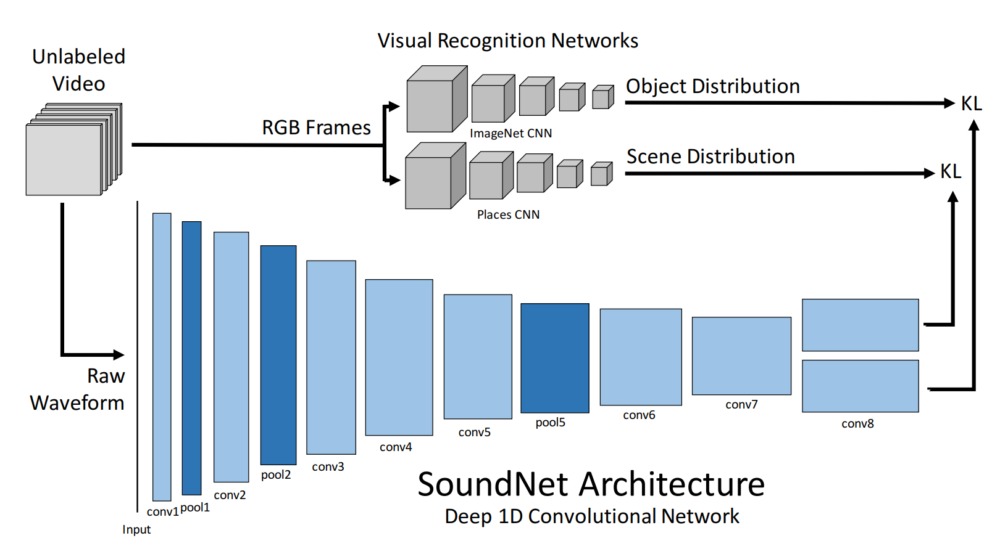

# soundnet_pytorch



[SoundNet](http://soundnet.csail.mit.edu/) is a CNN designed trained in an unsupervised manner for audio feature represenations. It was intialliy implemented in torch, popularized through TF. This is an attempt to make a solid usable repo with a PyTorch port from other repos.

The model is defined in `soundnet.py`. As we can see the current version only returns `conv7`, `y_obj`, and `y_scns` features from the model. These can be modified to extract any feature from the CNN in the `forward` function.

# Installation

This code requires `PyTorch` to run. You can install [following the instructions](https://pytorch.org/get-started/locally/) in their website, or if you are using conda the command is the following:

```
conda install pytorch torchvision torchaudio cudatoolkit=11.3 -c pytorch
```

## Extracting the features

To extract the features first you need to have the audio in the following format as it is specified in the original paper:
- Format: MP3
- Sample Rate: 22050 Hz
- Channels: 1 (mono)

To extract the audio from a folder with `.mp4` videos you can use ffmpeg as follows:

```
for file in videos/*;do filename=$(basename $file .mp4); ffmpeg -y -i $file -ac 1 -f mp3 -ar 22050 mp3/${filename}.mp3; done
```

Then you can run the extract features script after creating the target directory. In this case we have named it `./soundnet/raw`, but we recommend placing it next to the rest of your data.

```
python3 -u extract_feats.py -m models/sound8.npy -i ./mp3 -o ./soundnet/raw -f .mp3
```

This script extracts the `conv7`, `y_obj`, and `y_scns` features from the model and stores it in `.npy` format in a separate file per sample.


## Feature post-processing

At this point, SoundNet has extracted a sequence of feature vectors. A naive way to represent the audio with a single vector is to obtain the mean feature vector from the sequence. You can obtain such represenation by running the `get_avg_pool.py` scirpt for the `y_scns` features as follows:

```
python3 -u get_avg_pool.py -i ./soundnet/raw -o ./soundnet/avg_pooling/y_scns -f y_scns
```
